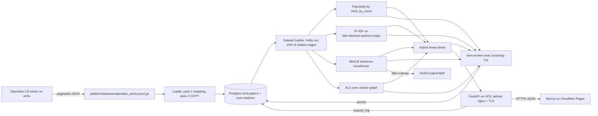

# arXiv recommender

Hybrid arXiv paper recommender on the OpenAlex Computer Science snapshot.
Compares five algorithms head to head: a popularity baseline, classical
TF-IDF on title and abstract, a MiniLM sentence-transformer over abstracts,
implicit ALS over the citation graph, and a hybrid linear blend. Held-out
evaluation, bootstrap confidence intervals on every metric, FAISS ANN for
serving, and a side-by-side dashboard.

> **Headline:** the hybrid recommender finds the held-out cited paper in the
> top 10 **14x more often** than a popularity baseline (hit-rate 0.43 vs 0.03;
> 20x on MAP@10), with p95 latency under 100 ms over a 28,000-paper catalogue.

**Analytical case study:**
[platform/docs/analysis/recommender-evaluation.md](platform/docs/analysis/recommender-evaluation.md).
It reads the evaluation and live system together and finds, among other things,
that the production blend was weighted toward the weaker of its two content
models. Grounded in real numbers and fully reproducible.

Live demo: <https://papers.scottcampbell.io>
Case study: <https://scottcampbell.io/projects/arxiv-recommender>

## Layout

```
arxiv-recommender/
  frontend/         Next.js 14 + TypeScript + Tailwind, exports to Cloudflare Pages
    src/app/        Layout + page (single-route dashboard)
    src/components/ KpiCard, KpiRow, Panel, SearchBar, SeedCard, AlgoColumn, RecCard, Leaderboard
    src/lib/        Typed FastAPI client, formatters, baked leaderboard
  platform/         Python backend, deployed to a Linux VPS by systemd
    arxrec/         Package: algo/, analysis/, api/, data/, db/, eval/, utils/
    docs/analysis/  Reproducible evaluation case study, figures, derived stats
    deploy/         systemd unit files, nginx site, deploy README, DB bootstrap
    scripts/        Screenshot harness, helper utilities
    tests/          pytest + hypothesis (property tests on ranking metrics)
    data/           OpenAlex JSONL (gitignored), pickled models, leaderboard.json
```

The two halves never share a runtime. The frontend reads
`NEXT_PUBLIC_API_BASE` at build time and points itself at the backend over
HTTPS. The backend serves JSON only.

## Deploy targets

| Component | Where | How |
|---|---|---|
| `frontend/` | Cloudflare Pages | static export, see `platform/deploy/README.md` |
| `platform/` (FastAPI + Postgres + FAISS) | Linux VPS, no Docker | systemd + nginx + Let's Encrypt |

`papers.scottcampbell.io` is the Cloudflare Pages frontend.
`api.papers.scottcampbell.io` is the FastAPI service on the VPS.

## What this project demonstrates

| Senior skill | Where it lives |
|---|---|
| Multiple recommender algorithms (popularity, TF-IDF, neural, ALS, hybrid) | `platform/arxrec/algo/` |
| Real evaluation (P, R, MAP, NDCG, hit-rate, coverage, diversity, ILS, bootstrap CIs) | `platform/arxrec/eval/` |
| Findings-driven analysis: significance testing, blend-weight tuning, behavioural overlap/concentration | `platform/docs/analysis/`, `platform/arxrec/analysis/`, `platform/arxrec/eval/tune_weights.py` |
| Item-to-item eval with held-out citation edges (academic-search convention) | `platform/arxrec/data/dataset.py` |
| Cold-paper handling, hybrid blend down-weights ALS when the seed is sparse | `platform/arxrec/algo/hybrid.py` |
| Production serving with FastAPI + FAISS ANN + request logging | `platform/arxrec/api/` |
| Sentence-transformer (MiniLM) encoder fitted to abstracts | `platform/arxrec/algo/content_neural.py` |
| Postgres with least-privilege role and dedicated schemas | `platform/arxrec/db/schema.sql` |
| Senior-grade dashboard, Bloomberg-terminal aesthetic, mobile responsive | `frontend/src/` |
| Property-based tests on every ranking metric | `platform/tests/` |
| Reproducibility, single seed controls splits and ALS init | `platform/arxrec/utils/seed.py` |
| Real deploy artefacts, systemd units, nginx config, Pages config | `platform/deploy/` |

## Architecture



## Algorithms in one paragraph each

- **Popularity** Cited-by count with a tiny publication-year tiebreak. The
  floor every other model has to beat.
- **TF-IDF** Sparse vector over title, abstract, authors, and primary
  topic. Row-normalised so cosine reduces to a dot product. Surprisingly
  strong on academic text because the vocabulary is highly disciplined.
- **Neural** `sentence-transformers/all-MiniLM-L6-v2`, 22M parameters,
  384-d output, L2-normalised. Encodes title plus the first 1,200
  characters of the abstract.
- **Citation ALS** Implicit-feedback ALS over a bipartite citation graph
  where citing papers act as users and cited papers act as items. 96
  factors, 18 iterations, alpha 8.
- **Hybrid** Linear blend of min-max normalised scores. Weights are chosen by an
  NDCG@10 simplex search over held-out citations, not by hand: 45% TF-IDF, 30%
  neural, 10% ALS, 15% log-shrunk popularity. (The original hand-set weights were
  neural-heavy; see the [case study](platform/docs/analysis/recommender-evaluation.md)
  for why re-tuning lifted held-out NDCG@10 ~20%.)

## Evaluation

For each test seed we hold out 10% of its outgoing citation edges before
training. We then ask, when the seed paper is used as the query, do the
held-out citations show up in the top 10?

- Precision@K, Recall@K, MAP@K, NDCG@K with 1,000-sample bootstrap 95% CIs.
- Coverage, the fraction of the catalogue ever recommended.
- Diversity and intra-list similarity in ALS-factor space.
- Cold-seed segment, seeds with very few train edges, reported separately.
- Latency, p50 and p95 wall-clock per `similar_items` call.

The leaderboard is persisted into `ml.eval_metric` per training run, so
every artefact is auditable.

## Local development

Requires Python 3.11+, Node 18+, and a local PostgreSQL 17 cluster.

```powershell
# 1. Backend
cd platform
python -m venv .venv
.\.venv\Scripts\pip install -e .[dev]
cp .env.example .env                          # fill in PGPASSWORD and OPENALEX_MAILTO
# Bootstrap the database, applies platform/arxrec/db/schema.sql
bash deploy/setup-database.sh                 # on Linux/Git Bash
# Fetch ~33k arXiv-hosted CS papers from OpenAlex, ~3 min on a polite-pool key
.\.venv\Scripts\python -m arxrec.data.openalex
.\.venv\Scripts\python -m arxrec.data.loader
$env:OPENBLAS_NUM_THREADS = "1"
.\.venv\Scripts\python -m arxrec.train --max-eval-seeds 2000
.\.venv\Scripts\python -m uvicorn arxrec.api.main:app --host 127.0.0.1 --port 8820

# 2. Frontend (in another shell)
cd ../frontend
cp .env.local.example .env.local
npm install
npm run dev                                    # http://localhost:3000
```

## Limitations

OpenAlex is the source of truth for both metadata and the citation graph.
Most papers cite older work outside our 2019+ subset, so the in-set
citation graph is sparser than a full graph would be (about 1.6 edges per
paper). Collaborative ALS therefore underperforms content here; in a real
production system you would either widen the date range or pull a second
hop of citations as shadow nodes to densify. The hybrid is set up to
absorb that improvement when it lands without any other code changes.

## License

MIT. Data from OpenAlex (CC0).
