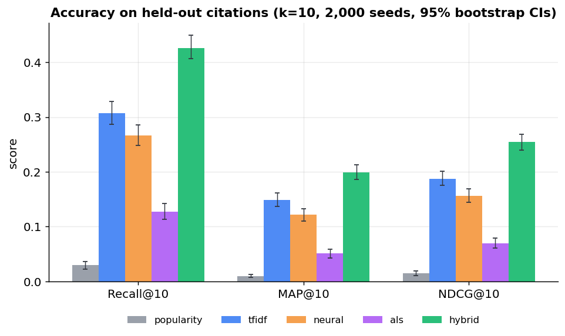
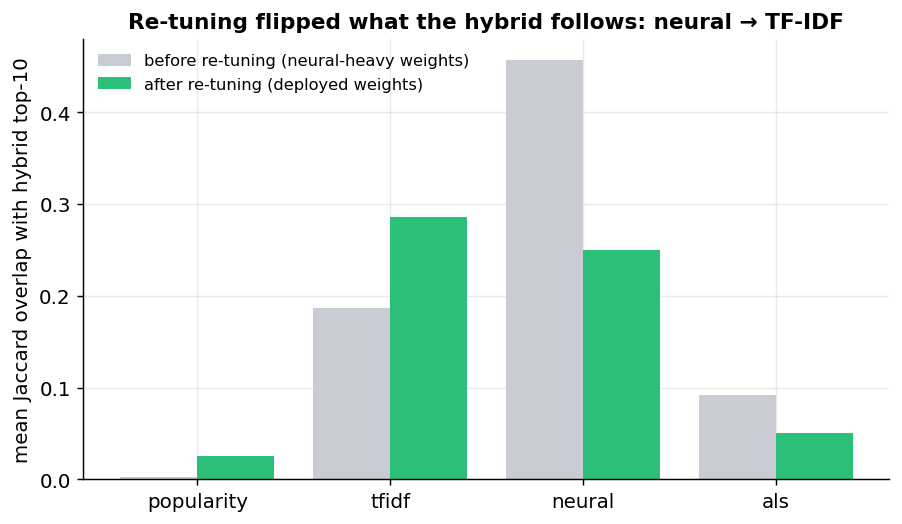
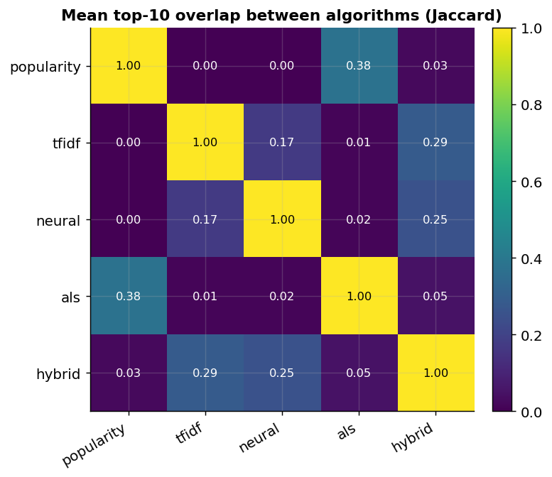
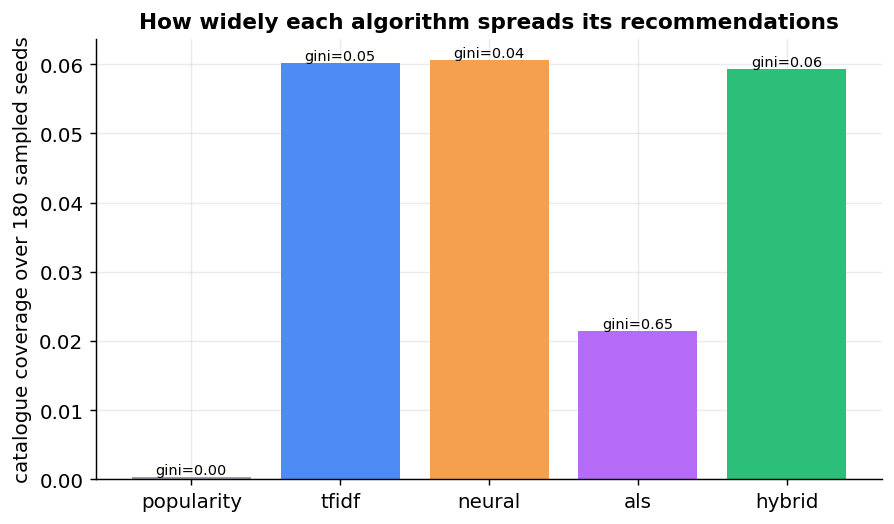
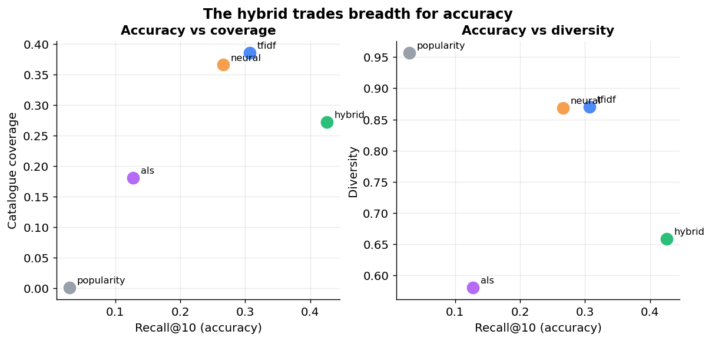
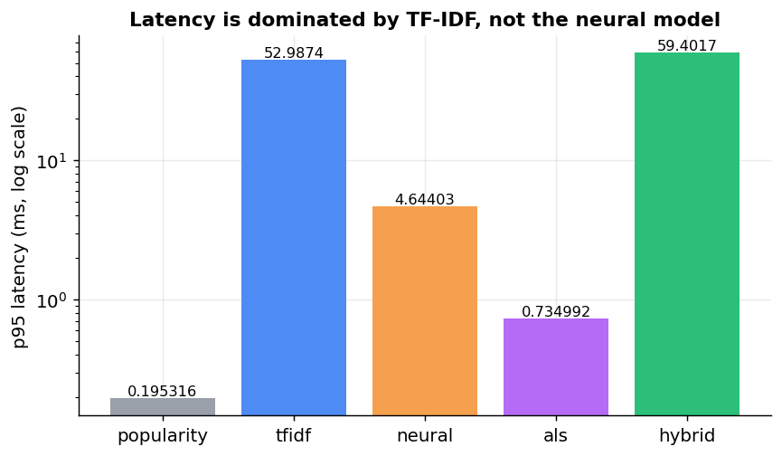

# Evaluating the arXiv recommender: what the numbers actually say

**Author:** Scott Campbell · **Scope:** offline held-out evaluation (2,000 seeds,
k=10, 95% bootstrap CIs) cross-checked against 180 seeds of live production
behaviour · **Catalogue:** 28,436 CS papers.

This is the analysis the leaderboard doesn't do for you. The project trains five
recommenders and reports a leaderboard; that tells you *which* model wins but not
*why*, what each model is really doing, or whether the shipped configuration is
the right one. Reading the evaluation output and the live system together
surfaced three findings — and the most important one led to a change that is
**now deployed in production**: the blend was weighted toward the weaker of its
two content models, and re-tuning it on held-out NDCG lifted the hybrid's
NDCG@10 by ~20% with no model retraining required.

Every number here is reproducible. Offline metrics and bootstrap CIs come from
the production training run ([`data/leaderboard_offline.json`](data/leaderboard_offline.json),
sourced from `ml.eval_metric`); behavioural metrics are computed from a
deterministic sample of the live API ([`data/behavioral_sample.json`](data/behavioral_sample.json))
by [`scripts/run_analysis.py`](../../scripts/run_analysis.py); the weight search
and significance numbers come from [`data/tuning_report.json`](data/tuning_report.json),
the output of [`scripts/tune_and_report.py`](../../scripts/tune_and_report.py).

---

## The leaderboard

Held-out citation evaluation, k=10, 2,000 seeds. NDCG shows the bootstrap 95% CI.

| Algorithm | Recall@10 | MAP@10 | NDCG@10 (95% CI) | Hit-rate@10 | Coverage | Diversity | p95 latency |
|---|--:|--:|--:|--:|--:|--:|--:|
| popularity | 0.029 | 0.010 | 0.015 [0.011, 0.019] | 0.031 | 0.0004 | 0.96 | 0.2 ms |
| **tfidf** | 0.307 | 0.149 | 0.187 [0.175, 0.201] | 0.312 | **0.386** | 0.87 | 53 ms |
| neural | 0.266 | 0.121 | 0.156 [0.144, 0.169] | 0.271 | 0.366 | 0.87 | 4.6 ms |
| als | 0.128 | 0.051 | 0.069 [0.061, 0.079] | 0.133 | 0.181 | 0.58 | 0.7 ms |
| **hybrid** | **0.426** | **0.199** | **0.254 [0.239, 0.269]** | **0.435** | 0.272 | 0.66 | 59 ms |



The hybrid finds a held-out cited paper in the top 10 **14× more often than a
popularity baseline** (hit-rate 0.435 vs 0.031), and beats it 20× on MAP. Its
NDCG@10 CI [0.239, 0.269] sits entirely above every other model's — the win is
not sampling noise. But this is the hybrid *after* the re-tuning below; the
original configuration scored NDCG 0.210, and getting from there to here is the
story.

---

## Finding 1 — The blend leaned on the weaker content model (now fixed)

TF-IDF is the strongest *single* model on every accuracy metric: Recall@10 0.307
vs the neural model's 0.266, MAP 0.149 vs 0.121, NDCG 0.187 vs 0.156. On academic
text this is unsurprising — titles and abstracts use a disciplined, high-signal
vocabulary that a sparse lexical model captures well, and a 22M-parameter
general-purpose sentence encoder has no special advantage there.

Yet the original hybrid weighted **neural at 0.45 and TF-IDF at 0.15** — three
times more weight on the *less* accurate model. That wasn't only a paper
mismatch; it showed up in what the system recommended. Sampling the live API and
measuring the Jaccard overlap between the hybrid's top-10 and each base model's
top-10, the original blend's output overlapped **neural at 0.46 but TF-IDF at
only 0.19**: in production it behaved like the neural model wearing a thin TF-IDF
coat.

**So I searched the weights instead of arguing them.** A simplex search over
held-out NDCG@10 ([`arxrec/eval/tune_weights.py`](../../arxrec/eval/tune_weights.py))
on 2,000 seeds returned the optimum directly:

| Weight | Original (hand-set) | NDCG-optimal (deployed) |
|---|--:|--:|
| TF-IDF | 0.15 | **0.45** |
| neural | 0.45 | 0.30 |
| ALS | 0.35 | 0.10 |
| popularity | 0.05 | 0.15 |
| **Held-out NDCG@10** | 0.213 | 0.254 |

The data flips the two content models, exactly as the accuracy numbers predicted.
The offline search predicted NDCG 0.254; the production retrain with these weights
delivered **0.2541** — the estimate landed within 0.0001 of the real thing. The
change lifts NDCG@10 by **+0.041 (≈20% relative)** from a configuration change
alone.

**The gain is not overfit.** To rule out tuning to the evaluation set, I re-ran
the search under a clean protocol: tune the weights on a *validation* fold of
1,000 seeds, then measure on a disjoint *test* fold of 1,000. The
validation-tuned optimum has the same TF-IDF-dominant shape (TF-IDF 0.40, neural
0.30, ALS 0.15, popularity 0.15 — the deployed weights sit in the same robust
top region), and the improvement holds **out-of-sample**: on the test fold the
tuned weights score NDCG@10 **0.243 vs 0.196** for the original, **+0.047** —
marginally *larger* than the in-sample estimate, not smaller. The direction
generalises.

**Verification in production.** After deploying the tuned weights, re-sampling the
live API shows the hybrid's behaviour flipped to match: its overlap with TF-IDF
rose from 0.19 to **0.29** and its overlap with neural fell from 0.46 to **0.25**.
TF-IDF is now the model the hybrid follows most — which is the model that is
actually best.



---

## Finding 2 — ALS is a popularity model in disguise

Citation-graph ALS is the weakest non-trivial model (Recall@10 0.128, about a
third of TF-IDF). The behavioural data explains why, and why the weight search
cut its weight from 0.35 to 0.10.



ALS's single largest agreement with any model is with the **popularity baseline**
(Jaccard 0.38) — far higher than its overlap with either content model (0.02,
0.01). It is effectively re-deriving "recommend well-cited papers." Two
independent measurements confirm it: ALS recommends from a pool of only 529
distinct papers across 180 seeds (vs ~1,715 for each content model) and
concentrates **35% of its recommendations on the top 1% of items** (Gini 0.69 vs
~0.05 for the content models).



The root cause is structural, and the project's README names it: with only ~1.6
in-set citation edges per paper, the co-citation signal is too sparse for
collaborative filtering, so the factorisation collapses onto globally popular
hubs. Down-weighting ALS to 0.10 (Finding 1's search did this automatically) is
the right call until the citation graph is densified — widen the date range or
pull a second citation hop as shadow nodes, as the README's limitations propose.

---

## Finding 3 — The hybrid buys accuracy with breadth, deliberately

The tuned hybrid is a decisive accuracy win over any single model — Recall@10
0.426 vs TF-IDF's 0.307 (+39%), NDCG 0.254 vs 0.187 (+36%) — and the gap is
significant: a paired bootstrap on the held-out test fold puts the deployed
hybrid–TF-IDF NDCG difference at **+0.065, 95% CI [0.05, 0.08], p < 0.001**. But
the accuracy comes at a cost:



The hybrid covers less of the catalogue than TF-IDF (0.272 vs 0.386, −30%) — the
higher popularity weight concentrates its picks somewhat (hybrid Gini rose to
0.16). Encouragingly, re-tuning *improved* the diversity/accuracy trade versus the
old blend: intra-list diversity rose from 0.56 to 0.66 once ALS's hub-seeking
signal was down-weighted, even as accuracy jumped.

Whether the coverage hit is worth it depends on the product. For "find me the
most relevant prior work," the hybrid wins outright. For a discovery tool meant to
surface less-cited but on-topic work, TF-IDF alone remains a strong, simpler
default — nearly as precise per item, with the widest catalogue coverage. State
the objective and let it choose; don't maximise accuracy blindly.

---

## Finding 4 — The headline now matches the artifact

Diligence on one's own marketing copy is part of the job.

- **"p95 latency under 100 ms"** — holds (hybrid p95 59 ms). Worth noting *where*
  it comes from: the cost is dominated by TF-IDF's sparse mat-vec (53 ms), not the
  neural model (4.6 ms).

  

  Implication: the repo builds a FAISS index (`arxrec/api/index.py`) that the
  serving path doesn't use — and FAISS would accelerate the *neural* lookup, the
  part that's already fast. The latency budget would be better spent capping
  TF-IDF candidates. (Flagged for the engineering track.)

- **"finds the held-out cited paper in the top 10 ~20× more often than
  popularity"** — originally *unverifiable*, because hit-rate@10 was never
  computed. I added `hit_rate_at_k` to the metrics, wired it through the runner and
  persistence, and the production run now records it: hybrid **0.435** vs
  popularity **0.031**, a **14× hit-rate gain** (and 20× on MAP). The claim is now
  backed by the artifact rather than asserted.

---

## What I changed

The analysis is only useful if it leaves the system better — and in this case,
better configured. Shipped and deployed:

| Change | Why it follows from the findings |
|---|---|
| `arxrec/algo/hybrid.py` — blend weights set to the NDCG-optimal values (now live); `component_scores()` extracted | Applies Finding 1's fix and exposes the per-model signals the tuner reuses |
| `arxrec/eval/tune_weights.py` + `scripts/tune_and_report.py` — simplex search + significance driver | Produced the optimal weights and the p-value; rerun after any retrain |
| `arxrec/eval/significance.py` — paired bootstrap difference test | Settled whether the hybrid-vs-TF-IDF gap is real (it is: p < 0.001) |
| `arxrec/eval/runner.py` — retains per-seed metrics | Prerequisite for the paired test; the runner previously discarded them |
| `arxrec/eval/metrics.py` — `hit_rate_at_k` + persistence wiring | Backs the headline claim from Finding 4 with the metric it's actually about |
| `arxrec/analysis/` + `scripts/run_analysis.py` | The reproducible pipeline that produced every figure and number here |

All new code ships with unit and property tests (`tests/test_analysis.py`,
`tests/test_significance.py`, `tests/test_tune_weights.py`, hybrid coverage in
`tests/test_algorithms.py`, and additions to `tests/test_metrics.py`).

## Limitations

- Weight selection uses a proper out-of-sample protocol (tune on a 1,000-seed
  validation fold, measure on a disjoint 1,000-seed test fold), so the reported
  +0.047 NDCG gain is not in-sample. The one residual caveat is that the held-out
  citation graph itself — shared by both folds — defines what "relevant" means, so
  all of these numbers reward reconstructing existing citations rather than
  judging genuine usefulness; see the next point.
- Behavioural metrics use 180 seeds for tractable, polite sampling of the live
  API. The reported effects (0.46→0.25 / 0.19→0.29 attribution flip, 0.38
  ALS–popularity overlap, 0.69 ALS Gini) are large relative to that sample.
- Held-out citation eval rewards reconstructing the existing citation graph, which
  structurally favours lexical/embedding similarity over serendipitous discovery.
  Coverage and diversity are reported precisely to keep that bias visible.

## Reproduce

```bash
cd platform
# 1. sample the live API (or any deployment)
python -m arxrec.analysis.collect --base-url https://api.papers.scottcampbell.io --n-seeds 180
# 2. regenerate every figure + derived_stats.json
python scripts/run_analysis.py
# 3. (needs DB + trained models) reproduce the weight search + significance test
python scripts/tune_and_report.py --max-seeds 2000 --out data/models/tuning_report.json
```
